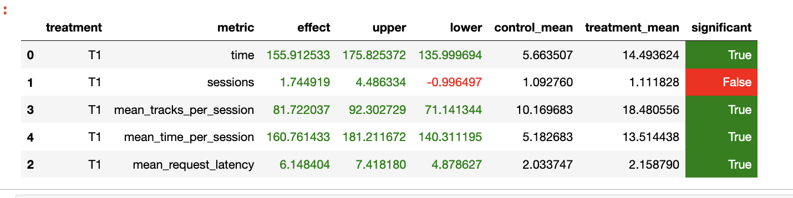

#### MADE HW, Куцко Яна (pasteyourtext@gmail.com)

## 1. Отчет:

### 1.1. Abstract: основную идею эксперимента
За основу были взяты рекомендации из Contextual рекомендера, но был изменен подход для рекомендации следующего трека. 
Для каждого пользователя заводится два кеша - 1) все прослушанные песни вместе с его фидбеком на них 2) песни, которые 
использовались для рекомендации следующей. Пользователь завходит на сервис, выбирает песню, затем ему рекомендуется 15
самых похожих на нее, когда он прослушает их все, то из его кеша выбирается песня, наиболее понравившаяся ему, но на
основе которой еще не рекомендовались следующие. Если ни одна из песен не понравилась достаточно сильно (более 0.5), то
рекомендуются самые популярые песни, с помощью TopPop

### 1.2. Детали: минимум того, что нужно знать, чтобы разобраться в реализации
Для учета прослушенных треков и треков, на основе которых, рекомендуются следующие заводятся два кеша. Так как пример
демонстративный, в их качестве использовались питоновские словари.

### 1.3. Результаты A/B эксперимента
Эксперемент на 3000 пользовательскиз сессий показал значимый прирост mean_time_per_session

## 2. Ссылка на репозиторий и инструкцию по запуску.
Репозиторий: https://github.com/genusB/recsys-itmo-spring-2023
Запуск контейнера с рекомендором: docker-compose up -d --build .
Запуск симмулятора: python sim/run.py --episodes 3000 --config config/env.yml multi --processes 2

Чисто от себя. Было бы интересно, если бы кроме имеющейся информации о треках были еще какие-то дополнительные фичи (жанр,
продолжительность, год, инструментальность, энергия и тд, как здесь https://www.kaggle.com/datasets/vatsalmavani/spotify-dataset)
с помощью которых можно бы было повытаскивать новую инфу. 
Я пыталась их получить самостоятельно через апи спотифая, но меня забанили за частые запросы(